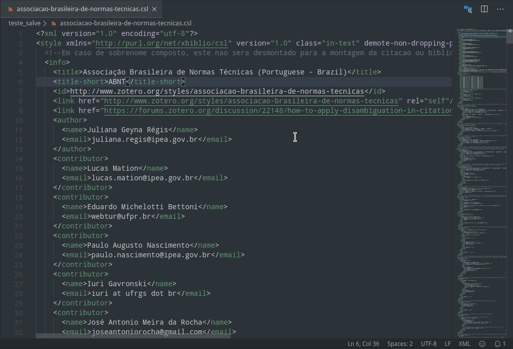
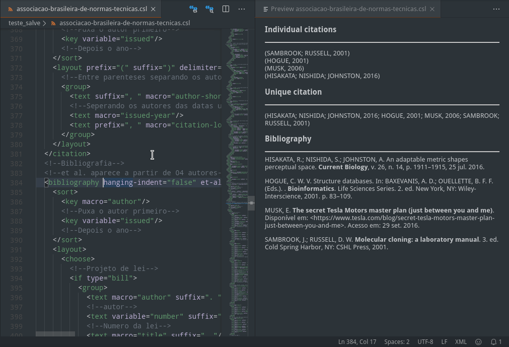
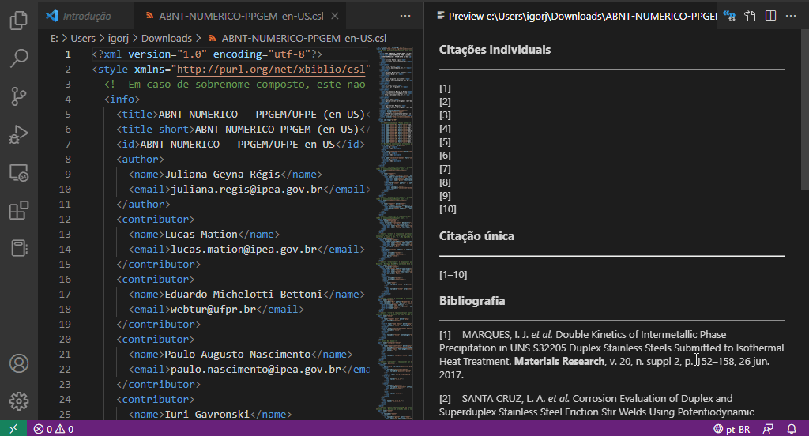

# CSL Preview for Visual Studio Code

A [Visual Studio Code](https://code.visualstudio.com/) extension that permits to easily see previews of how [Citation Style Language](https://citationstyles.org/) (CSL) code is structuring bibliographic data. It is strongly based in [Zotero](https://www.zotero.org/) preview, available at Zotero style code editor.

## Features

### Show CSL Preview

**Show CSL Preview** command can be fired by Visual Studio Code Command Palette or pressing the icon placed in the right top of text editor. Once the command is run, the user should select which bibliographic data source will be used by CSL Preview and then the preview window will be shown at right side of the active text editor.

Bibliographic data displayed can be supplied from the standard extension data, from an user entried DOI, or from a used entried JSON file path.

If the CSL code being edited presents errors that turn it inappropriate to structure bibliographic data, an [CSL-validator](https://simonster.github.io/csl-validator.js/) output will be shown at the preview window informing the errors in the CSL code.

When this command is fired with a text editor which already has an preview window it will turn the preview window active.

Please, notice that **Show CSL Command** is available only when editor language is set to XML. When a .csl file is open, the editor language is automatically changed to XML.

### Refresh CSL Preview

The CSL preview is not live time updated during code editing. However the preview can be quickly refreshed using the **Refresh CSL Preview** command, available in command palette, preview windows, and text editor windows (when the active text editor has an active preview window).

### Choose Locale

The user can select the locale displayed in preview using the command **Choose Locale** or clicking in locale status bar item, which presents the locale being displayed in the preview. The full set of locales available at CSL locales repository is available.

## Known Issues

There is no know issues at the moment. If you experience trobles when using the extension, please report it on extension GitHub repository.

## Release Notes

### 0.2.2

* Fixes [issue 12](https://github.com/igorjrd/vscode-cslpreview/issues/12)
* Update dependencies

### 0.2.1

New functionality: **Auto refresh preview**
* Updates automatically the preview window during document edition after a short delay (0.5 s)
* It should be activated on extension settings

### 0.2.0

New functionality additions:

* Option to choose a custom citables source JSON file
* Support to select the locale displayed in preview
* Added a status bar item showing the current locale displayed in preview
* Support to VSCode locales (currently supporting en-US and pt-BR)
* Extension configurations providing options do define default locale and citables source file

### 0.1.0

Initial release of CSL Preview for Visual Studio Code

Initial features:

* Support to multiple CSL preview windows linked to different text editor windows
* Bibliographic data used at preview can be from extension standard bibliographic data or an user input DOI
* Show CSL Preview, Refresh CSL Preview and Show CSL Source icons placed in text editor and preview windows and also in Command Palette

**Enjoy!**
